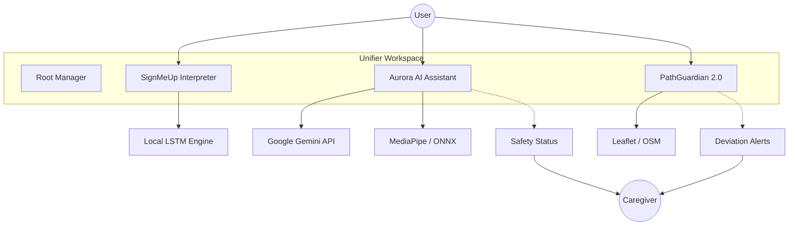

# Signmeup
### Advanced Wellness, Accessibility & Safety Suite

> [!NOTE]
> **Independent Mobility. Empathetic Support. Local Privacy.**

Technology has transformed how we communicate and navigate, yet its potential for specially-abled individuals remains under-explored. **UnifierBBinary** is an inclusive assistive solution designed to work across multiple abilities, moving beyond single-mode interactions (speech/text only) to a truly multimodal approach.

---

## The Three Pillars

### 1. [Aurora](BBinary) (AI Wellness Assistant)
The empathetic heart of the system.
- **Vision Intelligence**: Real-time detection of emotions, hydration events, and falls.
- **Conversational Memory**: Google Gemini-powered partner with situational awareness.
- **Biometric Dashboard**: Glassmorphism UI for live safety and activity monitoring.

### 2. [PathGuardian 2.0](PathGuardian) (Navigation)
Independent mobility, shared peace of mind.
- **Voice-First Wayfinding**: Large-button, voice-controlled navigation for seniors.
- **Caregiver Live Map**: Real-time tracking with route deviation alerts.
- **Simulation Mode**: Built-in demonstration for safety verification.

### 3. [SignMeUp](SignLanguageInterpreter) (Sign Recognition)
Privacy-focused local translation.
- **Local Gesture Recognition**: Personalized training for user-specific signs.
- **Edge Deployment**: Uses MediaPipe and LSTMs entirely in the browser.
- **Seamless Integration**: Accessible directly from the Aurora Dashboard.

---

## Architecture Overview



For a deeper dive, see our [Architecture Documentation](docs/ARCHITECTURE.md).

---

## Getting Started

The entire suite is managed by a centralized control layer.

### 1. Unified Installation
```bash
npm install
```

### 2. Configure Secrets
Create a `.env` file in the root directory:
```env
GOOGLE_API_KEY=your_key_here
VITE_MODEL_NAME=gemma-3-4b-it
```

### 3. Launch Services
```bash
npm run dev
```
Starts all modules: PathGuardian (8081), Aurora (5173), Sign Interpreter (3000).

---

## Documentation Index

- [Architecture & Design](docs/ARCHITECTURE.md)
- [Setup & Troubleshooting](docs/SETUP.md)
- [User Guide](docs/USER_GUIDE.md)

---

## Tech Stack Highlights

- **AI**: Google Gemini, MediaPipe, ONNX Runtime Web.
- **Frontend**: React 19, Vite 7, Next.js, TailwindCSS 4.
- **Privacy**: Edge ML processing, local persistence.
- **Accessibility**: 64px touch targets, high contrast, voice-first UI.

---

## Hackathon Context
Demonstrates how edge computing and conversational AI empower independent living while maintaining local privacy.
